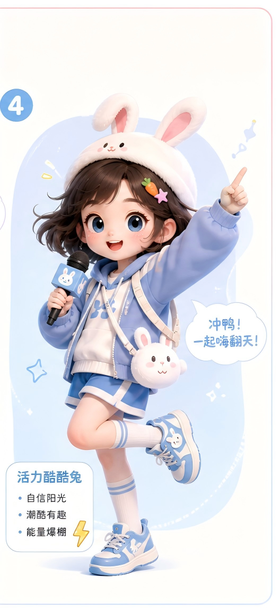

# Skill：高中数学复习资料制作 v2.0（视频网页 + 错题本系统）

> 版本 v2.0 ｜ 适用：家长/老师为高中生制作自学复习材料
> v1.0 → v2.0 升级要点：题目改选择题、新增错题本系统、支持多章节、错题可预览/打印/CSV下载

---

## 一、Skill 用途
输入一个高中数学知识点主题，产出一整套自学复习材料，由两个各司其职的独立文件组成：
1. **视频网页**：看视频 + 分难度题目（显示答案式），偏"学"。
2. **错题本系统**：做选择题 + 自动判分 + 错题收集管理，偏"练"。

---

## 二、⏳ 使用须知：本 Skill 分两个阶段完成

本 skill 含一个不可省略的人工环节（录制视频），因此需分两次调用：

**第 1 次调用｜生成脚本与题目**
- 输入：主题、子知识点、时长、学生水平
- 产出：视频串词脚本 + 分难度题目 + 选择题题库
- ⏸️ 此后暂停，由用户根据脚本录制并剪辑视频

**【用户线下完成】录制视频、导出文件**
- 按脚本录制，导出为 mp4 并命名（如：函数单调性.mp4）

**第 2 次调用｜生成两个网页文件**
- 输入：已录好的视频文件名（+ 可选吉祥物图片）
- 产出：视频网页.html + 错题本系统.html

> 💡 提示：若暂时没有视频，第 2 次调用也可先用占位文件名生成网页框架，
> 等视频准备好后按该文件名放进同目录即可，无需重新生成网页。

---

## 三、输入（调用时需提供）
- 学科章节主题：如"集合""函数"
- 子知识点：如"表示方法 / 基本关系 / 基本运算"
- 单集目标时长：如"每集 3 分钟"
- 目标学生水平：入门 / 复习 / 冲刺
- 素材（可选）：视频/音频文件、吉祥物图片

---

## 四、标准产出物
1. 每个子知识点一集的**视频串词脚本**（画面提示 + 口播文字）
2. **视频网页**（含视频 + 简单/中等/困难三档题、点击显示答案 + 进阶拓展卡片）
3. **错题本系统**（选择题判分 + 错题本 + 预览打印 + CSV下载 + 多章节Tab）

---

## 五、执行流程（Steps）

### 步骤 1：拆分知识点，规划集数
一个子知识点 = 一集，每集控制在目标时长（3 分钟约 550-650 字口播），集间加"上/下节课"衔接。

### 步骤 2：撰写视频串词
结构：开场 → 概念 → 分点讲解 → 例子 → 小结 → 下集预告。符号首次出现标读法，重点结论加粗。

### 步骤 3：出题（关键校验环节）
- 视频网页用"显示答案"式题目：简单/中等/困难各 3 题。
- 错题本系统用**选择题**：每题 4 个选项、1 个正确答案、标注知识点。
- ⚠️ **含参数题目必须把每个候选解代回验证互异性**，不能想当然。

### 步骤 4：生成两个网页文件（保持独立）
- **视频网页**：单文件，flex 三列、窄屏竖排，视频用本地文件名。
- **错题本系统**：单文件，顶部大知识点 Tab + 难度 Tab，题库集中在 `QUESTIONS` 数据区。
- 视频与错题本**不合并**，各存一个 html，共用同目录素材。

### 步骤 5：交付说明
- html 与视频、图片放同一文件夹。
- 错题本数据存 localStorage（限本机本浏览器），提醒用户定期"下载 CSV"备份。
- 在线分享需把视频托管到稳定外链平台。

---

## 六、错题本设计规范
错题本记录 5 项字段：**题目、正确答案、孩子选的错误答案、做错时间、涉及知识点**。
三种呈现方式：
- **表格**（错题本 Tab 内）：快速总览。
- **预览卡片**（🔍 预览/打印）：一题一卡，聚焦复习，可调浏览器打印。
- **CSV 下载**：长期备份，Excel 可开，含 BOM 头防中文乱码。

---

## 七、扩展方法（加章节 / 加题）
- **加题**：在错题本系统 `QUESTIONS` 里对应章节的 easy/mid/hard 数组内，按 `{stem, options, answer, topic}` 格式添加。`answer` 是正确项下标（从 0 起）。
- **加大章节**：① 在 `QUESTIONS` 加一块新章节数据；② 复制"集合"那段 panel 的 HTML 并改 id；③ 顶部 `main-tabs` 加一个 Tab 按钮；④ 底部调用 `renderQuestions` 渲染新章节三档题。

---

## 八、经验教训（Lessons Learned）
1. **时长先估算**：口播约 200-250 字/分钟，别把长内容塞进短时。
2. **视频优先本地文件名**：临时外链常因登录态/时效失效。
3. **数学题必须逐一验算**：含参数、互异性题目代回检验。
4. **区分音频/视频**：mp3 用 `<audio>`，mp4 用 `<video>`。
5. **布局别太长**：多集横向分列。
6. **localStorage 限本机**：务必提供下载备份，防换设备丢数据。
7. **视频与错题本分开**：定位不同，合并会让页面拥挤、逻辑复杂。

---

## 九、代码模板 A：视频网页

> 需同目录文件：集合表示法.mp4、集合基本关系.mp4、集合基本运算.mp4、兔子.png

```html
<!-- 见此前定稿的「视频网页」完整代码：三列布局 + 三档显示答案题 + 进阶拓展卡片 + 酷酷兔。
     换主题时替换视频文件名、标题、题目文字与进阶卡片内容即可。 -->
```

---

## 十、代码模板 B：错题本系统（完整可用）

> 需同目录文件：兔子.png（可选）

```html
<!DOCTYPE html>
<html lang="zh-CN">
<head>
<meta charset="UTF-8">
<meta name="viewport" content="width=device-width, initial-scale=1.0">
<title>高中数学 · 复习错题本系统 v2.0</title>
<style>
  * { margin:0; padding:0; box-sizing:border-box; }
  body { font-family:"PingFang SC","Microsoft YaHei",sans-serif;
    background:linear-gradient(135deg,#eaf2ff,#f5f9ff); color:#333; line-height:1.7; padding:16px; }
  .container { max-width:1000px; margin:0 auto; }
  .header { text-align:center; background:linear-gradient(135deg,#7b9cf0,#a6bef5);
    color:#fff; padding:22px; border-radius:20px; margin-bottom:18px; box-shadow:0 6px 20px rgba(123,156,240,.3); }
  .header h1 { font-size:24px; margin-bottom:4px; }
  .header p { font-size:13px; opacity:.95; }
  .main-tabs { display:flex; gap:8px; margin-bottom:16px; flex-wrap:wrap; }
  .main-tab { padding:10px 22px; border:none; border-radius:24px; cursor:pointer;
    font-size:15px; font-weight:bold; background:#fff; color:#7b8bad; box-shadow:0 2px 8px rgba(0,0,0,.05); transition:all .2s; }
  .main-tab.active { background:#7b9cf0; color:#fff; }
  .main-tab.wrong.active { background:#ec7a7a; }
  .panel { display:none; } .panel.active { display:block; }
  .card { background:#fff; border-radius:18px; padding:22px; margin-bottom:16px; box-shadow:0 4px 15px rgba(0,0,0,.06); }
  .card h2 { color:#5a7fd6; font-size:19px; margin-bottom:6px; }
  .card .desc { font-size:13px; color:#999; margin-bottom:14px; }
  .diff-tabs { display:flex; gap:6px; margin-bottom:14px; }
  .diff-tab { flex:1; border:none; padding:7px 0; border-radius:20px; cursor:pointer; font-size:13px; font-weight:bold; background:#eef2fb; color:#7b8bad; transition:all .2s; }
  .diff-tab.easy.active { background:#6ac48a; color:#fff; }
  .diff-tab.mid.active  { background:#f4b860; color:#fff; }
  .diff-tab.hard.active { background:#ec7a7a; color:#fff; }
  .diff-content { display:none; } .diff-content.active { display:block; }
  .q { background:#f8faff; border-radius:12px; padding:16px; margin-bottom:14px; }
  .q .stem { font-weight:bold; margin-bottom:10px; }
  .opt { display:block; width:100%; text-align:left; background:#fff; border:1.5px solid #e0e7f5; border-radius:10px; padding:9px 14px; margin-bottom:8px; cursor:pointer; font-size:14px; transition:all .15s; }
  .opt:hover { border-color:#7b9cf0; }
  .opt.correct { background:#eafaf0; border-color:#6ac48a; color:#2f7d4f; font-weight:bold; }
  .opt.wrong   { background:#fdeaea; border-color:#ec7a7a; color:#c0392b; font-weight:bold; }
  .opt:disabled { cursor:default; }
  .feedback { font-size:13px; margin-top:6px; font-weight:bold; }
  .feedback.ok { color:#2f7d4f; } .feedback.no { color:#c0392b; }
  .wrong-tools { display:flex; gap:10px; margin-bottom:14px; flex-wrap:wrap; }
  .btn { border:none; border-radius:20px; padding:9px 18px; cursor:pointer; font-size:13px; font-weight:bold; color:#fff; }
  .btn-preview { background:#7b9cf0; } .btn-download { background:#6ac48a; } .btn-clear { background:#ec7a7a; }
  .wrong-table { width:100%; border-collapse:collapse; font-size:13px; }
  .wrong-table th, .wrong-table td { border:1px solid #e0e7f5; padding:8px 10px; text-align:left; }
  .wrong-table th { background:#f0f5ff; color:#5a7fd6; }
  .empty { text-align:center; color:#999; padding:30px; }
  .modal-mask { display:none; position:fixed; inset:0; background:rgba(0,0,0,.5); z-index:200; padding:24px; overflow:auto; }
  .modal-mask.show { display:block; }
  .modal { max-width:800px; margin:0 auto; background:#fff; border-radius:16px; padding:26px; }
  .modal-head { display:flex; justify-content:space-between; align-items:center; margin-bottom:18px; border-bottom:2px solid #eef2fb; padding-bottom:12px; }
  .modal-head h2 { color:#5a7fd6; font-size:20px; }
  .modal-actions { display:flex; gap:8px; }
  .review-card { border:1px solid #e0e7f5; border-left:5px solid #ec7a7a; border-radius:10px; padding:16px; margin-bottom:14px; }
  .review-card .meta { font-size:12px; color:#999; margin-bottom:8px; }
  .review-card .tag { background:#eef2fb; color:#5a7fd6; border-radius:12px; padding:2px 10px; font-size:12px; margin-right:6px; }
  .review-card .rstem { font-weight:bold; margin-bottom:8px; }
  .review-card .line { font-size:14px; margin:3px 0; }
  .review-card .c-ok { color:#2f7d4f; font-weight:bold; } .review-card .c-no { color:#c0392b; font-weight:bold; }
  .footer { text-align:center; color:#999; font-size:13px; padding:16px; }
  .mascot { position:fixed; right:12px; bottom:12px; width:100px; z-index:100; }
  .mascot img { width:100%; border-radius:12px; }
  @media print {
    body * { visibility:hidden; }
    #printArea, #printArea * { visibility:visible; }
    #printArea { position:absolute; left:0; top:0; width:100%; }
    .modal-actions, .mascot { display:none !important; }
  }
</style>
</head>
<body>
<div class="container">
  <div class="header">
    <h1>🐰 高中数学 · 复习错题本系统</h1>
    <p>选章节 · 做选择题 · 自动收集错题 · 可预览可下载</p>
  </div>
  <div class="main-tabs">
    <button class="main-tab active" onclick="showPanel('p-jihe',this)">① 集合</button>
    <button class="main-tab" onclick="showPanel('p-more',this)">② 更多章节</button>
    <button class="main-tab wrong" onclick="showPanel('p-wrong',this);renderWrong()">📕 错题本</button>
  </div>
  <div class="panel active" id="p-jihe">
    <div class="card">
      <h2>集合</h2>
      <div class="desc">涵盖：表示方法、基本关系、基本运算。点选项即可自动判分，答错自动进错题本。</div>
      <div class="diff-tabs">
        <button class="diff-tab easy active" onclick="switchDiff(this,'j-easy')">简单</button>
        <button class="diff-tab mid"  onclick="switchDiff(this,'j-mid')">中等</button>
        <button class="diff-tab hard" onclick="switchDiff(this,'j-hard')">困难</button>
      </div>
      <div class="diff-content active" id="j-easy"></div>
      <div class="diff-content" id="j-mid"></div>
      <div class="diff-content" id="j-hard"></div>
    </div>
  </div>
  <div class="panel" id="p-more">
    <div class="card"><h2>更多章节</h2><div class="desc">可继续添加"函数""数列"等章节，添加方法见 skill 第七节。</div></div>
  </div>
  <div class="panel" id="p-wrong">
    <div class="card">
      <h2>📕 错题本</h2>
      <div class="desc">自动记录做错的题目。推荐用"预览"专心复习，用"下载"做长期备份。</div>
      <div class="wrong-tools">
        <button class="btn btn-preview" onclick="openPreview()">🔍 预览 / 打印</button>
        <button class="btn btn-download" onclick="downloadWrong()">⬇️ 下载备份(CSV)</button>
        <button class="btn btn-clear" onclick="clearWrong()">🗑️ 清空错题本</button>
      </div>
      <div id="wrong-list"></div>
    </div>
  </div>
  <div class="footer">口诀：交集看"且"，并集看"或"，补集看"不属于"。答错别灰心，进错题本再战一次！</div>
</div>
<div class="modal-mask" id="previewMask">
  <div class="modal">
    <div class="modal-head">
      <h2>📕 错题复习卡</h2>
      <div class="modal-actions">
        <button class="btn btn-download" onclick="window.print()">🖨️ 打印</button>
        <button class="btn btn-clear" onclick="closePreview()">✖ 关闭</button>
      </div>
    </div>
    <div id="printArea"></div>
  </div>
</div>
<div class="mascot"></div>
<script>
const QUESTIONS = {
  "集合": {
    easy: [
      { stem:"设 A={1,2,3,4}，下列正确的是？", options:["5∈A","3∈A","0∈A","6∈A"], answer:1, topic:"元素与集合的关系" },
      { stem:"表示实数集的符号是？", options:["N","Z","Q","R"], answer:3, topic:"常用数集符号" },
      { stem:"小于10的正偶数组成的集合是？", options:["{2,4,6,8}","{0,2,4,6,8}","{2,4,6,8,10}","{1,2,3,4}"], answer:0, topic:"列举法" }
    ],
    mid: [
      { stem:"集合 {x | x²=4, x∈R} 用列举法表示为？", options:["{2}","{-2,2}","{4}","{-4,4}"], answer:1, topic:"描述法与列举法转换" },
      { stem:"集合 A={a,b,c} 的子集个数是？", options:["6","7","8","9"], answer:2, topic:"子集个数公式" },
      { stem:"下列与集合 {-1,1} 相等的是？", options:["{x|x²=1}","{x|x=1}","{x|x>0}","{x|x²=-1}"], answer:0, topic:"集合相等" }
    ],
    hard: [
      { stem:"若 3∈{1, m, m²−m+1}，m 的值不可能是？", options:["3","2","-1","0"], answer:3, topic:"含参数集合(互异性)" },
      { stem:"若 {1,2}⊆A⊆{1,2,3,4}，满足条件的 A 有几个？", options:["2","3","4","8"], answer:2, topic:"子集计数" },
      { stem:"全集 U={1,2,3,4,5,6}，A={1,2,3}，B={2,3,4}，(∁ᵤA)∩B=？", options:["{4}","{4,5}","{5,6}","{4,5,6}"], answer:0, topic:"补集与交集综合" }
    ]
  }
};
const STORAGE_KEY = "math_wrong_book";
function renderQuestions(chapter, diff, containerId){
  const box = document.getElementById(containerId);
  const list = QUESTIONS[chapter][diff];
  box.innerHTML = list.map((q,i)=>{
    const opts = q.options.map((o,j)=>`<button class="opt" onclick="answer(this,'${chapter}',${i},${j},'${diff}')">${String.fromCharCode(65+j)}. ${o}</button>`).join("");
    return `<div class="q"><div class="stem">${i+1}. ${q.stem}</div>${opts}<div class="feedback"></div></div>`;
  }).join("");
}
function answer(btn, chapter, qIndex, chosen, diff){
  const qDiv = btn.closest(".q");
  if(qDiv.dataset.done) return; qDiv.dataset.done = "1";
  const q = QUESTIONS[chapter][diff][qIndex];
  const opts = qDiv.querySelectorAll(".opt"); opts.forEach(o=>o.disabled=true);
  const fb = qDiv.querySelector(".feedback"); opts[q.answer].classList.add("correct");
  if(chosen === q.answer){ fb.textContent="✅ 回答正确！"; fb.className="feedback ok"; }
  else {
    btn.classList.add("wrong"); fb.textContent="❌ 答错了，已加入错题本。"; fb.className="feedback no";
    saveWrong({ chapter, topic:q.topic, stem:q.stem,
      correct:String.fromCharCode(65+q.answer)+". "+q.options[q.answer],
      chosen:String.fromCharCode(65+chosen)+". "+q.options[chosen],
      time:new Date().toLocaleString("zh-CN") });
  }
}
function saveWrong(item){
  const data = JSON.parse(localStorage.getItem(STORAGE_KEY)||"[]");
  data.push(item); localStorage.setItem(STORAGE_KEY, JSON.stringify(data));
}
function renderWrong(){
  const data = JSON.parse(localStorage.getItem(STORAGE_KEY)||"[]");
  const box = document.getElementById("wrong-list");
  if(data.length===0){ box.innerHTML=`<div class="empty">🎉 目前没有错题，继续保持！</div>`; return; }
  box.innerHTML=`<table class="wrong-table"><tr><th>#</th><th>章节</th><th>知识点</th><th>题目</th><th>正确答案</th><th>孩子的选择</th><th>做错时间</th></tr>
    ${data.map((w,i)=>`<tr><td>${i+1}</td><td>${w.chapter}</td><td>${w.topic}</td><td>${w.stem}</td><td style="color:#2f7d4f">${w.correct}</td><td style="color:#c0392b">${w.chosen}</td><td>${w.time}</td></tr>`).join("")}</table>`;
}
function openPreview(){
  const data = JSON.parse(localStorage.getItem(STORAGE_KEY)||"[]");
  const area = document.getElementById("printArea");
  area.innerHTML = data.length===0 ? `<div class="empty">🎉 目前没有错题，继续保持！</div>`
    : data.map((w,i)=>`<div class="review-card"><div class="meta"><span class="tag">${w.chapter}</span><span class="tag">${w.topic}</span>做错时间：${w.time}</div><div class="rstem">${i+1}. ${w.stem}</div><div class="line">✅ 正确答案：<span class="c-ok">${w.correct}</span></div><div class="line">❌ 孩子的选择：<span class="c-no">${w.chosen}</span></div></div>`).join("");
  document.getElementById("previewMask").classList.add("show");
}
function closePreview(){ document.getElementById("previewMask").classList.remove("show"); }
function downloadWrong(){
  const data = JSON.parse(localStorage.getItem(STORAGE_KEY)||"[]");
  if(data.length===0){ alert("错题本是空的，暂无可下载内容。"); return; }
  let csv="\uFEFF序号,章节,知识点,题目,正确答案,孩子的选择,做错时间\n";
  data.forEach((w,i)=>{ csv+=[i+1,w.chapter,w.topic,w.stem,w.correct,w.chosen,w.time].map(x=>`"${String(x).replace(/"/g,'""')}"`).join(",")+"\n"; });
  const blob=new Blob([csv],{type:"text/csv;charset=utf-8"});
  const a=document.createElement("a"); a.href=URL.createObjectURL(blob);
  a.download="错题本_"+new Date().toLocaleDateString("zh-CN").replace(/\//g,"-")+".csv"; a.click();
}
function clearWrong(){ if(confirm("确定要清空错题本吗？建议先下载或预览打印备份。")){ localStorage.removeItem(STORAGE_KEY); renderWrong(); } }
function showPanel(id, btn){
  document.querySelectorAll(".panel").forEach(p=>p.classList.remove("active"));
  document.querySelectorAll(".main-tab").forEach(t=>t.classList.remove("active"));
  document.getElementById(id).classList.add("active"); btn.classList.add("active");
}
function switchDiff(btn, id){
  const card=btn.closest(".card");
  card.querySelectorAll(".diff-tab").forEach(t=>t.classList.remove("active"));
  card.querySelectorAll(".diff-content").forEach(c=>c.classList.remove("active"));
  btn.classList.add("active"); document.getElementById(id).classList.add("active");
}
renderQuestions("集合","easy","j-easy");
renderQuestions("集合","mid","j-mid");
renderQuestions("集合","hard","j-hard");
</script>
</body>
</html>
```
